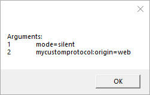

# DesktopAppLink

## Purpose

The goal of this project is to easily create weblinks that pass data to client software installed on any  device running windows.

## Using

It's fairly simple to use:

```csharp
 DesktopAppLink.CreateLink(
      "applink.sample", 
      "\"<path to exe>\"", 
      "<optionalStaticArgument>");
```
This will set up the protocol in the registry of your pc.

You then create link like this and embed it on any webpage.

```html
<a href="applink.sample:optionalArgumentsFromLink">Run Desktop App</a>
```

### Arguments
There are 2 types of arguments:
- static args (passed to the protocol upon creation)
- arguments that are passed with the protocol when invoking (via webbrowser)
	
#### Static Arguments
Static args are store in the registry of windows next to your protocol. The can only be changed using regedit.

#### Arguments from Hyperlink
Links from hyperlink will always be passed with the protocolname to the application:


```html
<a href="mycustomprotocol:origin=web">Click me!</a>
```



## Results

### Chrome


### Firefox


