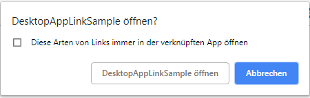
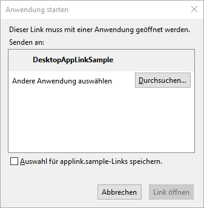

# DesktopAppLink

With DesktopAppLink any app on your system can be opened from your browser

## Usage:

It's fairly simple to use:

```csharp
 DesktopAppLink.CreateLink(
      "applink.sample", 
      "\"<path to exe>\"", 
      "\"-workingDir=<someDirectory>\"");
```

You then create link like this:

```html
<a href="applink.sample:">Run Desktop App</a>
```
## Results:

### Chrome:



### Firefox:


